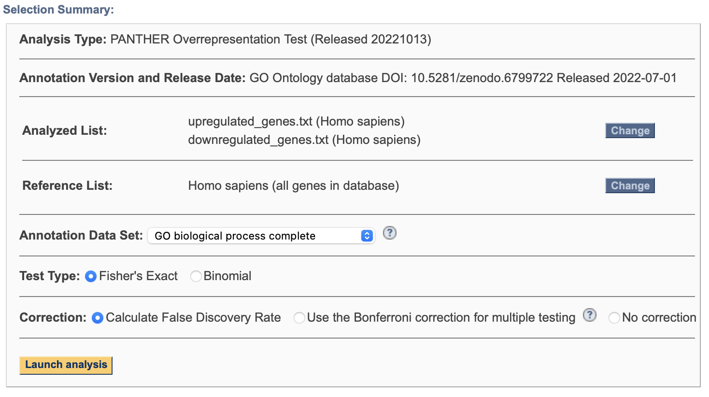
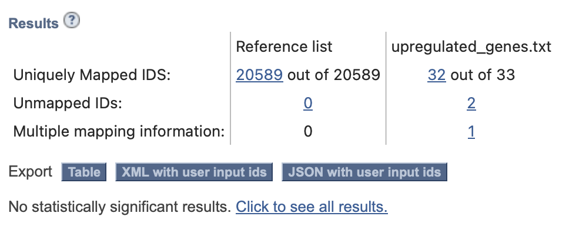
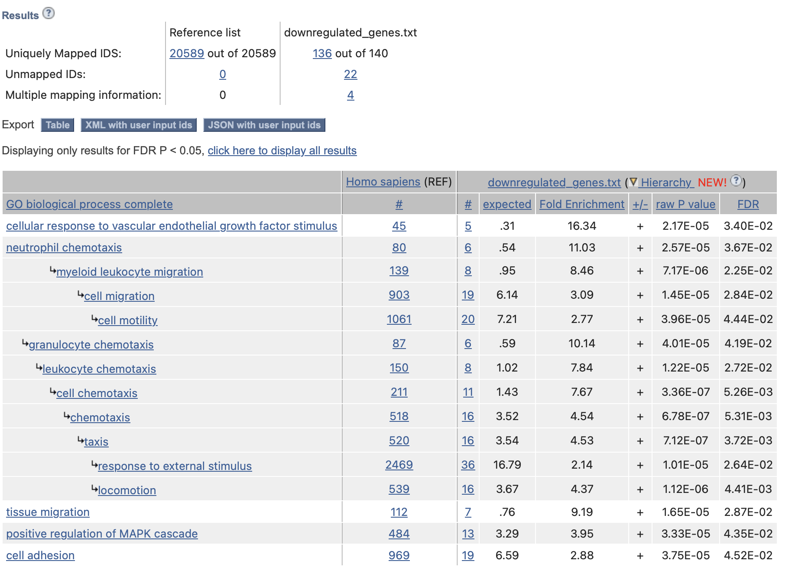
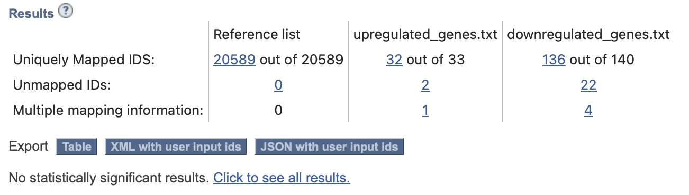

TODO: add figure captions!

use edgeR
# Installing and load required packages
```{r, echo = T, results='hide'}
packages <- c("edgeR", "ComplexHeatmap", "circlize", "colorspace", "limma")

# Check if packages are already installed
# If not, install packages
for(package in packages){
  if(!require(package, character.only = TRUE)){
    install.packages(package)
  }
}

# Load packages
lapply(packages, require, character.only = TRUE)
```


# Introduction on Data
The dataset is from a study of lipid remodeling in response to methionine stress in triple-negative breast cancer (TNBC) cells (Borrego et al., 2021). The dataset contains RNA profiles of two TNBC cell lines, one methionine-sensitive cell line (MDA-MBA-468) its methionine-insensitive derivative (MDA-MB-468res-R8), responding to methionine stress.

The data was downloaded from GEO Accession GSE155955

We will first download the normalized data and take a look at the data
```{r}
normalized_count_data <- readRDS("../data/normalized_count_data.rds")

# load(file = "../data/GSE155955.rda")
# normalized_counts: the normalized expression counts
# sample_info: information on samples in normalized_counts

# 
kable(normalized_count_data[1:5,1:5], type="html")
```


# Differential Expression Analysis
## Determining factors
We first need to determine which factors to account for in our analysis. Let's revisit the sample information. 

There are two different cell lines (MDA-MB-468 and MDA-MB-468res-R8), measured at 4 different hourly timepoints (0h, 0.5h, 2h, 12h) during methionine stress. Methionine stress was added by providing homocysteine instead of methionine in the cell lines' growth media. There are 3 replicates for each cell line. 
```{r}
# define groups
samples <- data.frame(lapply(colnames(normalized_count_data), 
        FUN=function(x){unlist(strsplit(x, 
                        split = "_"))}))
colnames(samples) <- colnames(normalized_count_data)
rownames(samples) <- c("cell.line","timepoint", "replicate")
samples <- data.frame(t(samples))
kable(samples, caption = "Sample Groups", col.names = c("Cell Line", "Timepoint (min)", "Replicate")) %>%
  kable_styling()
```


Let's create a heatmap to highlight trends in the data.
```{r}
heatmap_matrix <- t(scale(t(normalized_count_data)))
if(min(heatmap_matrix) == 0){
    heatmap_col = colorRamp2(c( 0, max(heatmap_matrix)), 
                      c( "white", "red"))
  } else {
    heatmap_col = colorRamp2(c(min(heatmap_matrix), 0,
        max(heatmap_matrix)), c("blue", "white", "red"))
  }
current_heatmap <- Heatmap(as.matrix(heatmap_matrix),
      show_row_dend = TRUE,show_column_dend = TRUE, 
      col=heatmap_col,show_column_names = TRUE, 
      show_row_names = FALSE,show_heatmap_legend = TRUE)

current_heatmap
```

We'll look at the MDS plot to visualize the factors in the samples
```{r}
pat_colors <- colorspace::qualitative_hcl(24, palette = "dark2")
pat_colors <- pat_colors[factor(colnames(heatmap_matrix))]
limma::plotMDS(heatmap_matrix,
               col = pat_colors, pch = 1)
legend("topright", fill=pat_colors,legend=factor(colnames(heatmap_matrix)), cex = 0.6, ncol = 4)
```
From the plot, we can see 4 clear clusters. The cluster at the bottom is MDA-MB-468 cell line at times 0h, 0.5h and 2h. The cluster to the left is MDA-MB-468res-R8 cell line at times 0h, 0.5h and 2h. The cluster at the top is MDA-MB-468 cell line at time 12h. The cluster to the right is MDA-MB-468res-R8 cell line at time 12h. The clustering is based on both the cell type and timepoint, therefore our model design should account for both these factors. 


## Differential Expression Analysis using edgeR
We will design our model to define groups based on cell line and timepoint. We prepare a DGEList of out normalized count data and the groups and use functions from the edgeR package to fit a quasi-likelihood negative binomial generalized log-linear model to our data and calculate the differential expression.
```{r}
model_design <- model.matrix(~ paste(samples$cell.line, samples$timepoint))
# DGEList 
d <- DGEList(counts=normalized_count_data, group=paste(samples$cell.line, samples$timepoint))
# Estimate Dispersion with model design.
d <- estimateDisp(d, model_design)

# Fit the model
fit <- glmQLFit(d, model_design)
qlf.results <- glmQLFTest(fit)
kable(topTags(qlf.results), type="html",row.names = FALSE)
```

We will look at the results to see how many genes pass the threshold p-value < 0.05, and how many genes pass the correction
```{r}
qlf_output_hits <- topTags(qlf.results,sort.by = "PValue",
                           n = nrow(normalized_count_data))
# pass the threshold p-value < 0.05
threshold_pval <- length(which(qlf_output_hits$table$PValue < 0.05))
print(paste("Number of genes that pass the threshold p-value < 0.05:", threshold_pval))

# pass correction?
correction <- length(which(qlf_output_hits$table$FDR < 0.05))
print(paste("Number of genes that pass correction:", correction))
```

ma plot


# Thresholded over-representation analysis
For the thresholded over-representation analysis, we'll be using the PANTHER statistical overrepresentation test, with the GO biological process complete annotation set. Below is screenshot showing the analysis details (only showing for downregulated, same details for upregulated).


We'll see how many genes are upregulated and donwregulated
```{r}
print(paste("Number of upregulated genes:", length(which(qlf_output_hits$table$PValue < 0.05 
             & qlf_output_hits$table$logFC > 0))))

# downregulated
print(paste("Number of donregulated genes:", length(which(qlf_output_hits$table$PValue < 0.05 
             & qlf_output_hits$table$logFC < 0))))
```


We will create and save thresholded list of genes.
```{r}
#merge gene names with the top hits
qlf_output_hits_withgn <- qlf_output_hits$table
qlf_output_hits_withgn$rank <- -log(qlf_output_hits_withgn$PValue,base =10) * sign(qlf_output_hits_withgn$logFC)
qlf_output_hits_withgn <- qlf_output_hits_withgn[order(qlf_output_hits_withgn$rank),]
upregulated_genes <- row.names(qlf_output_hits_withgn)[
  which(qlf_output_hits_withgn$PValue < 0.05 
             & qlf_output_hits_withgn$logFC > 0)]
downregulated_genes <- row.names(qlf_output_hits_withgn)[
  which(qlf_output_hits_withgn$PValue < 0.05 
             & qlf_output_hits_withgn$logFC < 0)]
write.table(x=upregulated_genes,
            file="../data/upregulated_genes.txt", sep = "\t",
            row.names = FALSE,col.names = FALSE,quote = FALSE)
write.table(x=downregulated_genes,
            file="../data/downregulated_genes.txt",sep = "\t",
            row.names = FALSE,col.names = FALSE,quote = FALSE)
write.table(x=data.frame(genename= row.names(qlf_output_hits_withgn),F_stat= qlf_output_hits_withgn$rank),
            file="../data/ranked_genelist.txt",sep = "\t",
            row.names = FALSE,col.names = FALSE,quote = FALSE)
```


## PANTHER analysis










# Interpretation


# References
@paper
@panther
@edgeR
@limma
@ComplexHeatmap
@circlize
@colorspace
