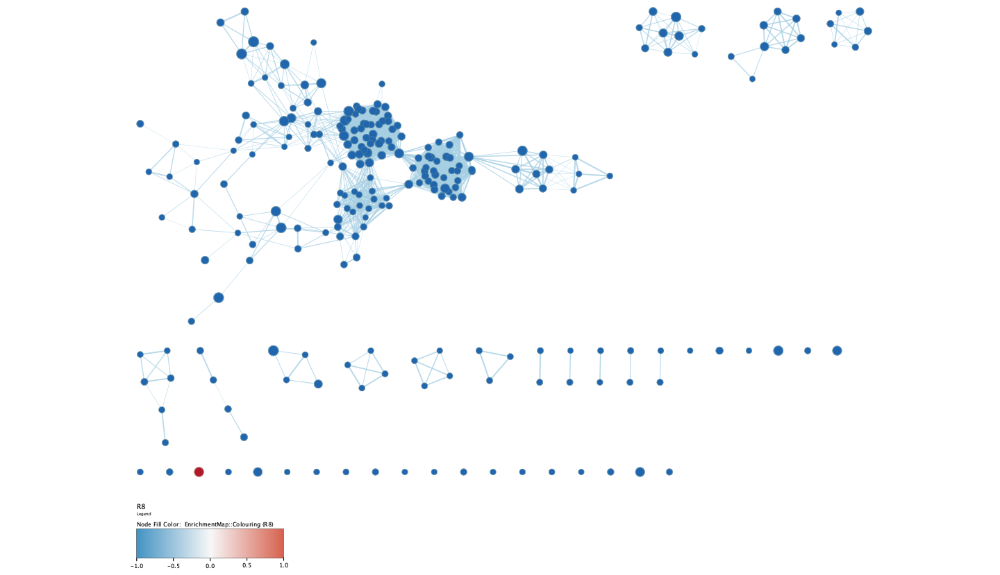

# Install and load required packages
```{r, echo = T, results='hide'}
# TODO: add required packages
bioc <- c()
cran <- c("knitr", "kableExtra")

# install BiocManager if needed
if (!require("BiocManager", quietly = TRUE))
    install.packages("BiocManager")

# install bioconductor packages if necessary
for (package in bioc) {
  if (!require(package, character.only = TRUE)) {
    BiocManager::install(package)
    require(package)
  }
}

# install cran packages if necessary
for(package in cran) {
  if(!require(package, character.only = TRUE)){
    install.packages(package)
    require(package)
  }
}
```

---

# Introduction
The dataset is from a study of lipid remodeling in response to methionine stress in triple-negative breast cancer (TNBC) cells (Borrego et al., 2021). The dataset contains RNA profiles of two TNBC cell lines, one methionine-sensitive cell line (MDA-MBA-468) its methionine-insensitive derivative (MDA-MB-468res-R8), responding to methionine stress. The data was downloaded from GEO Accession GSE155955.

In Assignment 1, the data was preprocessed and normalized. Gene identifiers were mapped to their HUGO Symbols. The data was normalized using Trimmed Mean of M-values (TMM). 

In Assignment 2, a differential expression analysis was conducted with the normalized expression expression data using the edgeR R package. Twoseparate differential expression analyses were performed; one for cell line MDA-MB-468, and the other for cell line MDA-MB-468res-R8. Next, a thresholded gene set enrichment analysis was performed with the significantly up-regulated and down-regulated set of genes from the analyses using g:Profiler and GO biological process terms. Three main term groups were returned: response to stimulus, cell death, and response to corticotropin-releasing hormone.

We will first read our data from Assignment 2. The file A2_data.rda contains `qlf_output_hits_MB468` and `qlf_output_hits_R8`, which are the results of the differential analyses for cell lines MDA-MB-468 and MDA-MB-468res-R8 respectively.

```{r}
load("../data/A2_data.rda")

# view data
kable(head(qlf_output_hits_MB468), type="html", caption = "Table 1. Head of ranked list for cell line MDA-MB-468") %>%
  kable_styling()

kable(head(qlf_output_hits_R8), type="html", caption = "Table 2. Head of ranked list for cell line MDA-MB-468res-R8") %>%
  kable_styling()
```

# Non-thresholded Gene set Enrichment Analysis
We will conduct a non-thresholded gene set enrichment analysis using ranked set of genes. We will first obtain our ranked gene lists.

```{r}
# MDA-MB-468
qlf_output_hits_MB468$rank <- log(qlf_output_hits_MB468$PValue, base = 10) * sign(qlf_output_hits_MB468$logFC)
qlf_output_hits_MB468 <- qlf_output_hits_MB468[order(qlf_output_hits_MB468$rank, decreasing = TRUE), ]
ranked_list_MB468 <- data.frame(GeneName = row.names(qlf_output_hits_MB468), 
                                Rank = qlf_output_hits_MB468$rank)


# MDA-MB-468res-R8
qlf_output_hits_R8$rank <- log(qlf_output_hits_R8$PValue, base = 10) * sign(qlf_output_hits_R8$logFC)
qlf_output_hits_R8 <- qlf_output_hits_R8[order(qlf_output_hits_R8$rank, decreasing = TRUE), ]
ranked_list_R8 <- data.frame(GeneName = row.names(qlf_output_hits_R8), 
                                Rank = qlf_output_hits_R8$rank)

# export 
write.table(ranked_list_MB468, "../data/ranked_list_MB468.rnk.txt", 
            sep = "\t", row.names = FALSE, quote = FALSE)
write.table(ranked_list_R8, "../data/ranked_list_R8.rnk.txt", 
            sep = "\t", row.names = FALSE, quote = FALSE)
```


We will use GSEA (version 4.3.2 for Mac) [@gsea] to conduct the gene set enrichment analysis on each of the ranked lists. We will use the human GO Biological process gene set collection from Enrichment Map gene sets from BaderLab [@enrichmentmap], speciifically file Human_GOBP_AllPathways_no_GO_iea_April_02_2023_symbol.gmt. We will be using GSEAPreranked as we are running GSEA on a pre-ranked list. 

The parameters for the analysis are as follows:

- Collapse/Rempap to gene symbols: No_Collapse
- Maximum size: 200
- Minimum size: 15

All other parameters are set to default.

The parameter Collapse/Remap to gene symbols is set to "No_Collapse". For the size of gene sets, the maximum size is set to 200 and the minimum size is set to 15. All other parameters are set to default. 

## Results for cell line MDA-MB-468
### MDA-MB-468 with methionine stress
- 3006 / 5119 gene sets are upregulated in cell line MDA-MB-468 with methionine stress
- 600 gene sets are significant at FDR < 25%
- 320 gene sets are significantly enriched at nominal pvalue < 1%
- 620 gene sets are significantly enriched at nominal pvalue < 5%

```{r}
mb468_pos <- read.delim("../data/gsea_report_for_na_pos_MB468.tsv", header = TRUE)
# drop unnecessary columns
mb468_pos <- mb468_pos[, !(names(mb468_pos) %in% c("GS.br..follow.link.to.MSigDB", "GS.DETAILS", "X"))]

kable(head(mb468_pos), type="html", caption = "Table 3. Head of positive enrichment GSEA results for cell line MDA-MB-468", row.names = FALSE) %>%
  kable_styling()
```


### MDA-MB-468 without methionine stress
- 2113 / 5119 gene sets are upregulated in cell line MDA-MB-468 without methionine stress
- 0 gene sets are significantly enriched at FDR < 25%
- 65 gene sets are significantly enriched at nominal pvalue < 1%
- 200 gene sets are significantly enriched at nominal pvalue < 5%

```{r}
mb468_neg <- read.delim("../data/gsea_report_for_na_neg_MB468.tsv", header = TRUE)
# drop unnecessary columns
mb468_neg <- mb468_neg[, !(names(mb468_neg) %in% c("GS.br..follow.link.to.MSigDB", "GS.DETAILS", "X"))]

kable(head(mb468_neg), type="html", caption = "Table 4. Head of negative enrichment GSEA results for cell line MDA-MB-468", row.names = FALSE) %>%
  kable_styling()
```

## Results for cell line MDA-MB-468res-R8
### MDA-MB-468res-R8 with methionine stress
- 3465 / 5119 gene sets are upregulated in cell line MDA-MB-468res-R8 with methionine stress
- 475 gene sets are significant at FDR < 25%
- 240 gene sets are significantly enriched at nominal pvalue < 1%
- 583 gene sets are significantly enriched at nominal pvalue < 5%

```{r}
r8_pos <- read.delim("../data/gsea_report_for_na_pos_R8.tsv", header = TRUE)
# drop unnecessary columns
r8_pos <- r8_pos[, !(names(r8_pos) %in% c("GS.br..follow.link.to.MSigDB", "GS.DETAILS", "X"))]

kable(head(r8_pos), type="html", caption = "Table 5. Head of positive enrichment GSEA results for cell line MDA-MB-468res-R8", row.names = FALSE) %>%
  kable_styling()
```

### MDA-MB-468res-R8 without methionine stress
- 1654 / 5119 gene sets are upregulated in cell line MDA-MB-468res-R8 without methionine stress
- 655 gene sets are significantly enriched at FDR < 25%
- 362 gene sets are significantly enriched at nominal pvalue < 1%
- 556 gene sets are significantly enriched at nominal pvalue < 5%

```{r}
r8_neg <- read.delim("../data/gsea_report_for_na_neg_R8.tsv", header = TRUE)
# drop unnecessary columns
r8_neg <- r8_neg[, !(names(r8_neg) %in% c("GS.br..follow.link.to.MSigDB", "GS.DETAILS", "X"))]

kable(head(r8_neg), type="html", caption = "Table 5. Head of negative enrichment GSEA results for cell line MDA-MB-468res-R8", row.names = FALSE) %>%
  kable_styling()
```

todo:

- Summarize your enrichment results.
- How do these results compare to the results from the thresholded analysis in Assignment #2. Compare qualitatively. Is this a straight forward comparison? Why or why not?

---

# Visualize your Gene set Enrichment Analysis in Cytoscape
We will visualize the results using EnrichmentMap (version 3.3.5) [@enrichmentmap] in Cytoscape (version 3.9.1 for Mac OS X) [@cytoscape].

We will make two enrichment maps, one for each cell line. Below are the parameters used to create the enrichment map. All other parameters were set to default.

- Analysis Type: GSEA
- Enrichments Pos: gsea_report_for_na_pos.tsv (from GSEA results)
- Enrichments Neg: gsea_report_for_na_neg.tsv (from GSEA results)
- GMT: Human_GOBP_AllPathways_no_GO_iea_April_02_2023_symbol.gmt.txt
- Ranks: ranked_list_<cell line>.rnk.txt (list used for GSEA)

In Advanced Options, 

- FDR q-value cutoff: 0.05
- p-value cutoff: 0.05
- Parse baderlab names in GMT file &#10003;

Once network is produced, the "Publication-Ready" option was selected. Legends were added using the Legend Creator app.


## MDA-MB-468
### Initial Cytoscape network

__Figure 1. Initial Enrichment Map for cell line MDA-MB-468.__ Each node represents a gene set, and each edge represents an interaction between two gene sets. The size of each node represents the size of the gene set. The colour of the nodes are based on the formula 1 - p-value, multiplied by the sign of the enrichment score. 


There are 135 nodes and 1167 edges in the network for cell line MDA-MB-468. The gene sets were filtered to only include those with p-value < 0.05 and FDR < 0.05 into the network above.


### Annotated network
The AutoAnnotate app was used to annotate the network [@autoannotate]. Below are the parameters used. All other parameters were set to default.

- Use clusterMaker App &#10003;
    * Cluster algorithm: MCL Cluster
    * Edge weight column: similarity_coefficient


__Figure 2. Annotated Enrichment Map for cell line MDA-MB-468.__ Each yellow circle represents a cluster of gene sets.  The size of the annotations are proportional to the cluster size.


There are 17 clusters in the network. The size of the annotations are proportional to the cluster size. 


### Theme network
A theme network was created by collapsing the above annotated network.

__Figure 3. Theme for cell line MDA-MB-468.__ Each node represents a cluster of gene sets.  The size of the annotations are proportional to the cluster size.


## MDA-MB-468res-R8
### Initial Cytoscape network

__Figure 4. Initial Enrichment Map for cell line MDA-MB-468res-R8.__ Each node represents a gene set, and each edge represents an interaction between two gene sets. The size of each node represents the size of the gene set. The colour of the nodes are based on the formula 1 - p-value, multiplied by the sign of the enrichment score. 


There are 251 nodes and 2241 edges in the network for cell line MDA-MB-468res-R8. The gene sets were filtered to only include those with p-value < 0.05 and FDR < 0.05 into the network above. 


### Annotated network
The AutoAnnotate app was used to annotate the network [@autoannotate]. Below are the parameters used. All other parameters were set to default.

- Use clusterMaker App &#10003;
    * Cluster algorithm: MCL Cluster
    * Edge weight column: similarity_coefficient


__Figure 5. Annotated Enrichment Map for cell line MDA-MB-468res-R8.__ Each yellow circle represents a cluster of gene sets.  The size of the annotations are proportional to the cluster size.

There are 33 clusters in the network. The size of the annotations are proportional to the cluster size. 


### Theme network
A theme network was created by collapsing the above annotated network.


# Interpretation and detailed view of results

The most important aspect of the analysis is relating your results back to the initial data and question.

Do the enrichment results support conclusions or mechanism discussed in the original paper? How do these results differ from the results you got from Assignment #2 thresholded methods
Can you find evidence, i.e. publications, to support some of the results that you see. How does this evidence support your result?
Using your networks and results from the previous section add one of the following:

Add a post analysis to your main network using specific transcription factors, microRNAs or drugs. Include the reason why you chose the specific miRs, TFs or drugs (i.e publications indicating that they might be related to your model). What does this post analysis show?
Choose a specific pathway or theme to investigate in more detail. Why did you choose this pathway or theme? Show the pathway or theme as a gene network or as a pathway diagram. Annotate the network or pathway with your original log fold expression values and p-values to show how it is effected in your model. (Hint: if the theme or pathway is not from database that has detailed mechanistic information like Reactome you can use apps like GeneMANIA or String to build the the interaction network.)
Sometimes the most interesting information is the gene that has no information. In this type of pathway analysis we can only discover what we have already described previously in the literature or pathway databases. Often pathways found in one disease are applicable to other diseases so this technique can be very helpful. It is important to highlight any genes that are significantly differentially expressed in your model but are not annotated to any pathways. We refer to this set of genes as the dark matter.
Include a heatmap of any significant genes that are not annotated to any of the pathways returned in the enrichment analysis.
Include a heatmap of any significant genes that are not annotated to any pathways in entire set of pathways used for the analysis.


# References
@paper
@gsea
@cytoscape
@enrichmentmap
@autoannotate