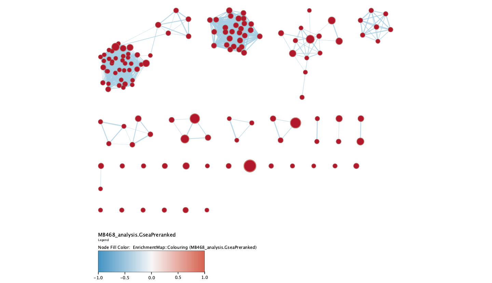

# Install and load required packages
```{r, echo = T, results='hide'}
bioc <- c()
cran <- c("knitr", "kableExtra")

# install BiocManager if needed
if (!require("BiocManager", quietly = TRUE))
    install.packages("BiocManager")

# install bioconductor packages if necessary
for (package in bioc) {
  if (!require(package, character.only = TRUE)) {
    BiocManager::install(package)
    require(package)
  }
}

# install cran packages if necessary
for(package in cran) {
  if(!require(package, character.only = TRUE)){
    install.packages(package)
    require(package)
  }
}
```

---

# Introduction
The dataset is from a study of lipid remodeling in response to methionine stress in triple-negative breast cancer (TNBC) cells (Borrego et al., 2021). The dataset contains RNA-seq profiles of two TNBC cell lines, one methionine-sensitive cell line (MDA-MBA-468) its methionine-insensitive derivative (MDA-MB-468res-R8), responding to methionine stress. The data was downloaded from GEO Accession GSE155955.

In Assignment 1, the data was preprocessed and normalized. Gene identifiers were mapped to their HUGO Symbols. The data was normalized using Trimmed Mean of M-values (TMM). 

In Assignment 2, a differential expression analysis was conducted with the normalized expression expression data using the edgeR package [@edgeR]. Two separate differential expression analyses were performed; one for cell line MDA-MB-468, and the other for cell line MDA-MB-468res-R8. Next, a thresholded gene set enrichment analysis was performed with the significantly up-regulated and down-regulated set of genes from the analyses using g:Profiler [@gprofiler] and GO biological process terms. Three main term groups were returned: response to stimulus, cell death, and response to corticotropin-releasing hormone.

We will first read our data from Assignment 2. The file A2_data.rda contains `qlf_output_hits_MB468` and `qlf_output_hits_R8`, which are the results of the differential analyses for cell lines MDA-MB-468 and MDA-MB-468res-R8 respectively.

```{r}
load("../data/A2_data.rda")

# view data
kable(head(qlf_output_hits_MB468), type="html", caption = "Table 1. Head of ranked list for cell line MDA-MB-468") %>%
  kable_styling()

kable(head(qlf_output_hits_R8), type="html", caption = "Table 2. Head of ranked list for cell line MDA-MB-468res-R8") %>%
  kable_styling()
```

# Non-thresholded Gene set Enrichment Analysis
We will conduct a non-thresholded gene set enrichment analysis using ranked set of genes. We will first obtain our ranked gene lists from our results in Assignment 2. 

```{r}
# MDA-MB-468
qlf_output_hits_MB468$rank <- log(qlf_output_hits_MB468$PValue, base = 10) * sign(qlf_output_hits_MB468$logFC)
qlf_output_hits_MB468 <- qlf_output_hits_MB468[order(qlf_output_hits_MB468$rank, decreasing = TRUE), ]
ranked_list_MB468 <- data.frame(GeneName = row.names(qlf_output_hits_MB468), 
                                Rank = qlf_output_hits_MB468$rank)


# MDA-MB-468res-R8
qlf_output_hits_R8$rank <- log(qlf_output_hits_R8$PValue, base = 10) * sign(qlf_output_hits_R8$logFC)
qlf_output_hits_R8 <- qlf_output_hits_R8[order(qlf_output_hits_R8$rank, decreasing = TRUE), ]
ranked_list_R8 <- data.frame(GeneName = row.names(qlf_output_hits_R8), 
                                Rank = qlf_output_hits_R8$rank)

# export 
write.table(ranked_list_MB468, "../data/ranked_list_MB468.rnk.txt", 
            sep = "\t", row.names = FALSE, quote = FALSE)
write.table(ranked_list_R8, "../data/ranked_list_R8.rnk.txt", 
            sep = "\t", row.names = FALSE, quote = FALSE)
```


We will use GSEA [@gsea] (version 4.3.2 for Mac) to conduct the gene set enrichment analysis on each of the ranked lists. We will use the human GO Biological process gene set collection from Enrichment Map gene sets from BaderLab [@enrichmentmap], specifically file Human_GOBP_AllPathways_no_GO_iea_April_02_2023_symbol.gmt. We will be using GSEAPreranked as we are running GSEA on a pre-ranked list. 

The parameters for the analysis are as follows:

- Collapse/Rempap to gene symbols: No_Collapse
- Maximum size: 200
- Minimum size: 15

All other parameters are set to default.

## Results for cell line MDA-MB-468
### MDA-MB-468 with methionine stress
- 3006 / 5119 gene sets are upregulated in cell line MDA-MB-468 with methionine stress
- 600 gene sets are significant at FDR < 25%
- 320 gene sets are significantly enriched at nominal pvalue < 1%
- 620 gene sets are significantly enriched at nominal pvalue < 5%

The top five rows of the results are shown below. The common themes among the positively enriched gene sets were metabolic and biosynthetic processes of lipids, specifically chlolesterol and sterols. 

```{r}
mb468_pos <- read.delim("../data/gsea_report_for_na_pos_MB468.tsv", header = TRUE)
# drop unnecessary columns
mb468_pos <- mb468_pos[, !(names(mb468_pos) %in% c("GS.br..follow.link.to.MSigDB", "GS.DETAILS", "X"))]

kable(head(mb468_pos, n = 5), type="html", caption = "Table 3. Head of positive enrichment GSEA results for cell line MDA-MB-468", row.names = FALSE) %>%
  kable_styling()
```


### MDA-MB-468 without methionine stress
- 2113 / 5119 gene sets are downregulated in cell line MDA-MB-468 with methionine stress
- 0 gene sets are significantly enriched at FDR < 25%
- 65 gene sets are significantly enriched at nominal pvalue < 1%
- 200 gene sets are significantly enriched at nominal pvalue < 5%

The top five rows of the results are shown below. The common themes among the most enriched gene sets were membrane invagination and tRNA processing. However, no gene sets were significantly enriched at FDR < 25%. 

```{r}
mb468_neg <- read.delim("../data/gsea_report_for_na_neg_MB468.tsv", header = TRUE)
# drop unnecessary columns
mb468_neg <- mb468_neg[, !(names(mb468_neg) %in% c("GS.br..follow.link.to.MSigDB", "GS.DETAILS", "X"))]

kable(head(mb468_neg, n = 5), type="html", caption = "Table 4. Head of negative enrichment GSEA results for cell line MDA-MB-468", row.names = FALSE) %>%
  kable_styling()
```

## Results for cell line MDA-MB-468res-R8
### MDA-MB-468res-R8 with methionine stress
- 3465 / 5119 gene sets are upregulated in cell line MDA-MB-468res-R8 with methionine stress
- 475 gene sets are significant at FDR < 25%
- 240 gene sets are significantly enriched at nominal pvalue < 1%
- 583 gene sets are significantly enriched at nominal pvalue < 5%

The top five rows of the results are shown below. There was no clear common theme among the most enriched gene sets.

```{r}
r8_pos <- read.delim("../data/gsea_report_for_na_pos_R8.tsv", header = TRUE)
# drop unnecessary columns
r8_pos <- r8_pos[, !(names(r8_pos) %in% c("GS.br..follow.link.to.MSigDB", "GS.DETAILS", "X"))]

kable(head(r8_pos, n = 5), type="html", caption = "Table 5. Head of positive enrichment GSEA results for cell line MDA-MB-468res-R8", row.names = FALSE) %>%
  kable_styling()
```

### MDA-MB-468res-R8 without methionine stress
- 1654 / 5119 gene sets are downregulated in cell line MDA-MB-468res-R8 with methionine stress
- 655 gene sets are significantly enriched at FDR < 25%
- 362 gene sets are significantly enriched at nominal pvalue < 1%
- 556 gene sets are significantly enriched at nominal pvalue < 5%

The top five rows of the results are shown below. The common themes among the enriched gene sets were ribosomal synthesis and rRNA processing.

```{r}
r8_neg <- read.delim("../data/gsea_report_for_na_neg_R8.tsv", header = TRUE)
# drop unnecessary columns
r8_neg <- r8_neg[, !(names(r8_neg) %in% c("GS.br..follow.link.to.MSigDB", "GS.DETAILS", "X"))]

kable(head(r8_neg, n = 5), type="html", caption = "Table 5. Head of negative enrichment GSEA results for cell line MDA-MB-468res-R8", row.names = FALSE) %>%
  kable_styling()
```

## Comparison with results from Assignment 2
The significantly enriched gene sets in our gene set enrichment analysis differ from the results from te thresholded over-representation analysis in Assignment 2. In Assignment 2, the significantly enriched gene sets had three main themes, response to stimulus, cell death and response to corticotropin-releasing hormone. 

In our gene set enrichment analysis, the main theme of the upregulated gene sets for cell line MDA-MB-468 was metabolic and biosynthetic processes of lipids, and the downregulated gene sets were related to membrane invagination and tRNA processing. There was no clear main theme of the upregulated gene sets for methionine-insensitive derivative cell line MDA-MB-468res-R8, while main themes of the downregulated gene sets were ribosomal synthesis and rRNA processing.

The differences in the results are expected; in Assignment 2, only a total of 49 genes were considered in the analysis, as this was the total number of differentially expressed genes. In our gene set enrichment analysis, all 13078 genes were considered. Therefore, the different results can be attributed to the significant difference in the magnitude of data considered.

---

# Visualize your Gene set Enrichment Analysis in Cytoscape
We will visualize the results using EnrichmentMap (version 3.3.5) [@enrichmentmap] in Cytoscape (version 3.9.1 for Mac OS X) [@cytoscape].

We will make two enrichment maps, one for each cell line. Below are the parameters used to create the enrichment map. All other parameters were set to default.

- Analysis Type: GSEA
- Enrichments Pos: gsea_report_for_na_pos.tsv (from GSEA results)
- Enrichments Neg: gsea_report_for_na_neg.tsv (from GSEA results)
- GMT: Human_GOBP_AllPathways_no_GO_iea_April_02_2023_symbol.gmt.txt
- Ranks: ranked_list_<cell line>.rnk.txt (list used for GSEA)

In Advanced Options, 

- FDR q-value cutoff: 0.05
- p-value cutoff: 0.05
- Parse baderlab names in GMT file &#10003;

Once network is produced, the "Publication-Ready" option was selected. Legends were added using the Legend Creator app.


## MDA-MB-468
### Initial Cytoscape network

__Figure 1. Initial Enrichment Map for cell line MDA-MB-468.__ Each node represents a gene set, and each edge represents an interaction between two gene sets. The size of each node represents the size of the gene set. The colour of the nodes follow the legend and are based on the formula 1 - p-value, multiplied by the sign of the enrichment score. 


There are 135 nodes and 1167 edges in the network for cell line MDA-MB-468. The gene sets were filtered to only include those with p-value < 0.05 and FDR < 0.05 into the network above. As shown in the previous section, no gene sets were significantly downregulated, therefore no downregulated gene sets are included in the network. 


### Annotated network
The AutoAnnotate app was used to annotate the network [@autoannotate]. Below are the parameters used. All other parameters were set to default.

- Use clusterMaker App &#10003;
    * Cluster algorithm: MCL Cluster
    * Edge weight column: similarity_coefficient


__Figure 2. Annotated Enrichment Map for cell line MDA-MB-468.__ Each yellow circle represents a cluster of gene sets.  The size of the annotations are proportional to the cluster size.


There are 17 clusters in the network. The size of the annotations are proportional to the cluster size. 


### Theme network
A theme network was created by collapsing the above annotated network.

__Figure 3. Theme for cell line MDA-MB-468.__ Each node represents a cluster of gene sets.  The size of the annotations are proportional to the cluster size.

The largest themes are zoledronate action pathway (39 gene sets) and svnthesis valine protein (28 gene sets). The remaining 15 themes have less than 10 gene sets in their clusters. 

## MDA-MB-468res-R8
The same approach was applied to the gene set enrichment analysis results for cell line MDA-MB-468res-R8.

### Initial Cytoscape network

__Figure 4. Initial Enrichment Map for cell line MDA-MB-468res-R8.__ Each node represents a gene set, and each edge represents an interaction between two gene sets. The size of each node represents the size of the gene set. The colour of the nodes follow the legend and are based on the formula 1 - p-value, multiplied by the sign of the enrichment score. 


There are 251 nodes and 2241 edges in the network for cell line MDA-MB-468res-R8. The gene sets were filtered to only include those with p-value < 0.05 and FDR < 0.05 into the network above. Only one gene set was significantly upregulated (HALLMARK_TNFA_SIGNALING_VIA_NFKB, Genes regulated by NF-kB in response to TNF), all other significantly enriched gene sets were downregulated.


### Annotated network
The AutoAnnotate app was used to annotate the network [@autoannotate]. The same parameters that were used for cell line MDA-MB-468 were used for the annotation.


__Figure 5. Annotated Enrichment Map for cell line MDA-MB-468res-R8.__ Each yellow circle represents a cluster of gene sets.  The size of the annotations are proportional to the cluster size.

There are 33 clusters in the network. The size of the annotations are proportional to the cluster size. 


### Theme network
A theme network was created by collapsing the above annotated network.

__Figure 6. Theme for cell line MDA-MB-468res-R8.__ Each node represents a cluster of gene sets.  The size of the annotations are proportional to the cluster size.

The largest themes are selenocysteine synthesis valine (47 gene sets), apc degradation securin (35 gene sets), and slbp mature transcript (22 gene sets). The remaining 30 themes have less than 10 gene sets in their clusters. 

# Interpretation and detailed view of results

## Results for MDA-MB-468
Looking at our networks for cell line MDA-MB-468, a major theme of the significant positively enriched gene sets in the cell lines with methionine stress is relating to lipids. In the paper, when methionins stress was added, a global lipid response was induced [@paper]. Our results are consistent with this finding, as we see themes such as "chain fatty acid" and "cellular lipid catabolic" in the theme network. 

No gene sets were significantly downregulated (FDR < 0.05) for cell line MDA-MB-468 with methionine stress.


## Results for MDA-MB-468res-R8
Methionine is is the precursor to S-adenosylmethionine (SAM), the main methyl donor in the cell. SAM is a co-factor for a variety of methyltransferases that catalyze methylation events on DNA, RNA, proteins, and lipids [@paper]. Therefore, if methionine stress were added, i.e., there were a lack of methionine, core processes on DNA, RNA, proteins, and lipids would be inhibited. 

In our results, major themes of the significantly negatively enriched gene sets when methionine is added the the cell lines are relating to transcription, RNA and genetic related themes. This is consistent with the effects of methionine stress stated earlier.  


# References
@paper
@gsea
@cytoscape
@enrichmentmap
@autoannotate
@edgeR
@gprofiler